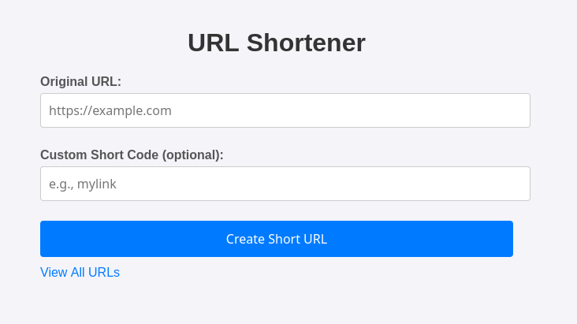
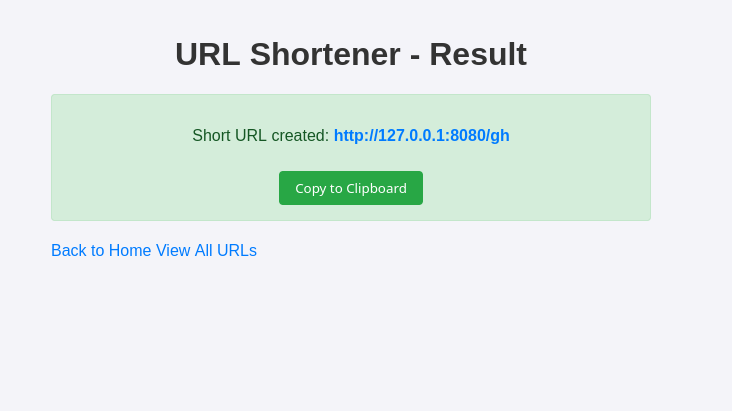
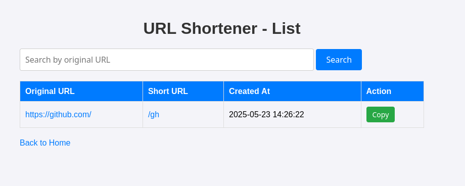

# Golink - URL Shortener

AI generated.
___

A simple URL shortening service built with Go, PostgreSQL, and Basic Auth. Supports random and custom short codes, a list of created URLs with search, and copy-to-clipboard functionality.

## Features
- Create short URLs with random or custom codes.
- Basic Auth for protected routes (`/`, `/create`, `/list`).
- List all URLs with search by original URL.
- Copy short URLs to clipboard.
- PostgreSQL for persistent storage.

## Prerequisites
- Go 1.22+
- PostgreSQL 15+
- Docker (optional, for containerized deployment)
- `github.com/gorilla/mux` and `github.com/lib/pq` dependencies
